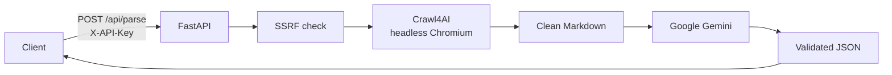

# AI Parser

**Turn any public webpage into structured JSON.**

AI Parser is a small FastAPI service that opens a URL in headless Chromium, strips ads, navigation, and cookie banners into clean Markdown, then asks Google Gemini to extract exactly what you asked for — as valid JSON.

No scrapers to maintain. No brittle CSS selectors. You describe the data. The pipeline does the rest.

<p align="center">
  
  
  
  
  
</p>

---

## What it does

You send a URL and a task in plain English (or any language the model understands):

```json
{
  "url": "https://example.com/products",
  "task": "Extract every product: name, price, currency, and in-stock status"
}
```

You get back pretty-printed JSON plus metadata (model used, character count, whether the page was truncated, processing time).

Typical uses:

- Product catalogs and price lists
- Job postings, event listings, directories
- Article metadata (title, author, date, summary)
- Any page where “I know what I want, I don’t want to write a scraper”

---

## How it works



1. **Authenticate** — every request needs `X-API-Key`.
2. **Guard the URL** — DNS is resolved and private / loopback / link-local IPs are rejected (SSRF protection, including cloud metadata `169.254.169.254`).
3. **Crawl** — Crawl4AI + Playwright load the page like a real browser, then drop `script`, `style`, `nav`, ads, overlays, and consent popups.
4. **Prompt** — your task plus the cleaned Markdown go to Gemini with `response_mime_type=application/json`.
5. **Format** — the reply is parsed, pretty-printed, and returned with a suggested filename.

The crawler is tuned for a modest server: text mode, light Chromium mode, no image loading, ads blocked at the browser network layer.

---

## Project structure

```
Ai-Parser/
├── app/
│   ├── main.py         # FastAPI routes: /api/health, /api/parse
│   ├── config.py       # Settings from environment / .env
│   ├── security.py    # API key + public-URL SSRF checks
│   ├── crawler.py      # Crawl4AI / Playwright Markdown extraction
│   ├── prompts.py     # System prompt and user-prompt builder
│   ├── llm.py          # Google Gemini client
│   └── formatters.py  # JSON validation and pretty-print
├── Dockerfile
├── docker-compose.yml
├── requirements.txt
├── .env.example
└── LICENSE
```

---

## Requirements

- [Docker](https://docs.docker.com/get-docker/) and Docker Compose (recommended), **or**
- Python **3.11+**, Playwright / Chromium, and a [Google Gemini API key](https://aistudio.google.com/apikey)

The API is bound to `127.0.0.1:8000` in Compose so it is not published on the public network by default.

---

## Quick start (Docker)

This is the intended way to run the project.

### 1. Clone

```bash
git clone https://github.com/Agregatt0r/ai-parser.git
cd ai-parser
```

### 2. Configure secrets

```bash
cp .env.example .env
```

Edit `.env`:

| Variable | Required | Purpose |
|---|---|---|
| `API_KEY` | yes | Secret you send as `X-API-Key` |
| `GEMINI_API_KEY` | yes | Key from [Google AI Studio](https://aistudio.google.com/apikey) |
| `GEMINI_MODEL` | no | Default `gemini-2.5-flash` |
| `CRAWL_TIMEOUT_MS` | no | Page load timeout (default `30000`) |
| `MAX_TASK_LENGTH` | no | Max characters in `task` |
| `MAX_URL_LENGTH` | no | Max characters in `url` |
| `MAX_MARKDOWN_CHARS` | no | Markdown budget sent to the model (default `100000`) |
| `CORS_ORIGINS` | no | Comma-separated origins, or `*` |
| `RATE_LIMIT` | no | SlowAPI limit, default `20/minute` |

Generate a strong `API_KEY`, for example:

```bash
python -c "import secrets; print(secrets.token_urlsafe(32))"
```

### 3. Build and run

```bash
docker compose up --build
```

First build downloads Chromium inside the image and can take a few minutes. After that:

- API: `http://127.0.0.1:8000`
- Interactive docs: [http://127.0.0.1:8000/docs](http://127.0.0.1:8000/docs)
- OpenAPI schema: [http://127.0.0.1:8000/openapi.json](http://127.0.0.1:8000/openapi.json)

Swagger’s **Authorize** button: type your `API_KEY` as the value for `X-API-Key`.

### 4. Stop

```bash
docker compose down
```

---

## Local development (without Docker)

Use this when you want to iterate on Python code. You still need Chromium for crawls.

```bash
python3.11 -m venv .venv
source .venv/bin/activate          # Windows: .venv\Scripts\activate
pip install -r requirements.txt
playwright install chromium
cp .env.example .env              # then edit .env
uvicorn app.main:app --reload --host 127.0.0.1 --port 8000
```

`pydantic-settings` reads `.env` from the working directory. Run commands from the repo root.

---

## API

All endpoints require header:

```
X-API-Key: <your API_KEY>
```

Rate limit: `20` requests per minute per client IP (configurable). Over the limit → HTTP `429`.

### `GET /api/health`

Checks that the process is up and that Gemini answers a tiny ping.

```bash
curl -s http://127.0.0.1:8000/api/health \
  -H "X-API-Key: $API_KEY"
```

Example:

```json
{
  "status": "ok",
  "gemini": { "reachable": true, "status": "ok" }
}
```

### `POST /api/parse`

**Body**

| Field | Type | Rules |
|---|---|---|
| `url` | string | `http` or `https`, public host only |
| `task` | string | What to extract; be specific |

**Success (200)**

| Field | Meaning |
|---|---|
| `success` | `true` |
| `output_format` | always `json` |
| `content` | Pretty-printed JSON string (or raw text if parsing failed) |
| `filename` | Suggested download name, e.g. `parsed_20260829_144500.json` |
| `mime_type` | `application/json` |
| `warning` | Present if Gemini’s text was not valid JSON |
| `meta.url` | URL that was crawled |
| `meta.model` | Gemini model name |
| `meta.markdown_chars` | Length of cleaned Markdown |
| `meta.truncated` | `true` if Markdown was cut to `MAX_MARKDOWN_CHARS` |
| `meta.processing_time_seconds` | Wall time for crawl + model |

**Errors**

| Status | When |
|---|---|
| `401` | Missing or wrong API key |
| `400` | Invalid URL, private/local IP, scheme not http(s) |
| `429` | Rate limit |
| `502` | Crawl failed, empty page, or Gemini error |
| `500` | Unexpected server error |

### Example: extract products

```bash
curl -s http://127.0.0.1:8000/api/parse \
  -H "Content-Type: application/json" \
  -H "X-API-Key: $API_KEY" \
  -d '{
    "url": "https://books.toscrape.com/",
    "task": "List the books on the page. For each book return title, price, and rating."
  }'
```

### Example: Python client

```python
import json
import os
import httpx

API = "http://127.0.0.1:8000"
headers = {"X-API-Key": os.environ["API_KEY"]}

payload = {
    "url": "https://books.toscrape.com/",
    "task": "Return a JSON array of objects with keys title, price, rating.",
}

with httpx.Client(timeout=120.0) as client:
    r = client.post(f"{API}/api/parse", json=payload, headers=headers)
    r.raise_for_status()
    data = r.json()
    print(data["content"])  # string; json.loads(data["content"]) for a dict/list
```

### Writing a good `task`

Be explicit about shape and missing data:

- “Return a JSON **array** of objects with keys `title`, `price`, `currency`.”
- “If a field is missing, use `null`.”
- “Only include items visible on this page. Do not invent products.”

The system prompt already forbids inventing facts and requires JSON-only output.

---

## Security

| Control | What it does |
|---|---|
| API key | Timing-safe compare of `X-API-Key` |
| SSRF filter | Hostname must resolve only to public addresses |
| Rate limit | Per-IP cap via SlowAPI |
| CORS | Configurable allow-list (`CORS_ORIGINS`) |
| Compose bind | `127.0.0.1:8000` — not `0.0.0.0` |

The SSRF check resolves DNS once before the crawler runs. It does **not** fully stop DNS rebinding or redirect chains. For a hosted deployment, also block outbound traffic from the container to `169.254.169.254` and RFC1918 ranges at the firewall.

Do not commit `.env`. `.gitignore` already excludes it.

---

## Configuration reference

Values are read by `pydantic-settings` from the environment (and `.env`). Names match the table in Quick start.

`CORS_ORIGINS` is a comma-separated list. Example for a local UI:

```
CORS_ORIGINS=http://localhost:5173,http://127.0.0.1:5173
```

`RATE_LIMIT` uses SlowAPI syntax, e.g. `10/minute`, `100/hour`.

---

## Troubleshooting

| Symptom | What to try |
|---|---|
| `401` | Header name is `X-API-Key`. Value must match `API_KEY` in `.env` exactly. |
| `Gemini API request failed` | Check `GEMINI_API_KEY`, model name, and quota in AI Studio. |
| Crawl timeout / empty page | Increase `CRAWL_TIMEOUT_MS`. Some sites block datacenter IPs or require login. |
| Docker build fails on Chromium | The image installs OS libs then `playwright install chromium`. Retry with a clean build: `docker compose build --no-cache`. |
| ARM Mac / ARM Linux | The crawler uses bundled **Chromium**, not Google Chrome, so ARM64 is supported. |
| Health `gemini.reachable: false` | Network from the container to Google, or a bad key. |

---

## License

[MIT](LICENSE) — use it, fork it, ship it.

---

## Credits

- [FastAPI](https://fastapi.tiangolo.com/)
- [Crawl4AI](https://github.com/unclecode/crawl4ai)
- [Playwright](https://playwright.dev/)
- [Google Gemini](https://ai.google.dev/)
